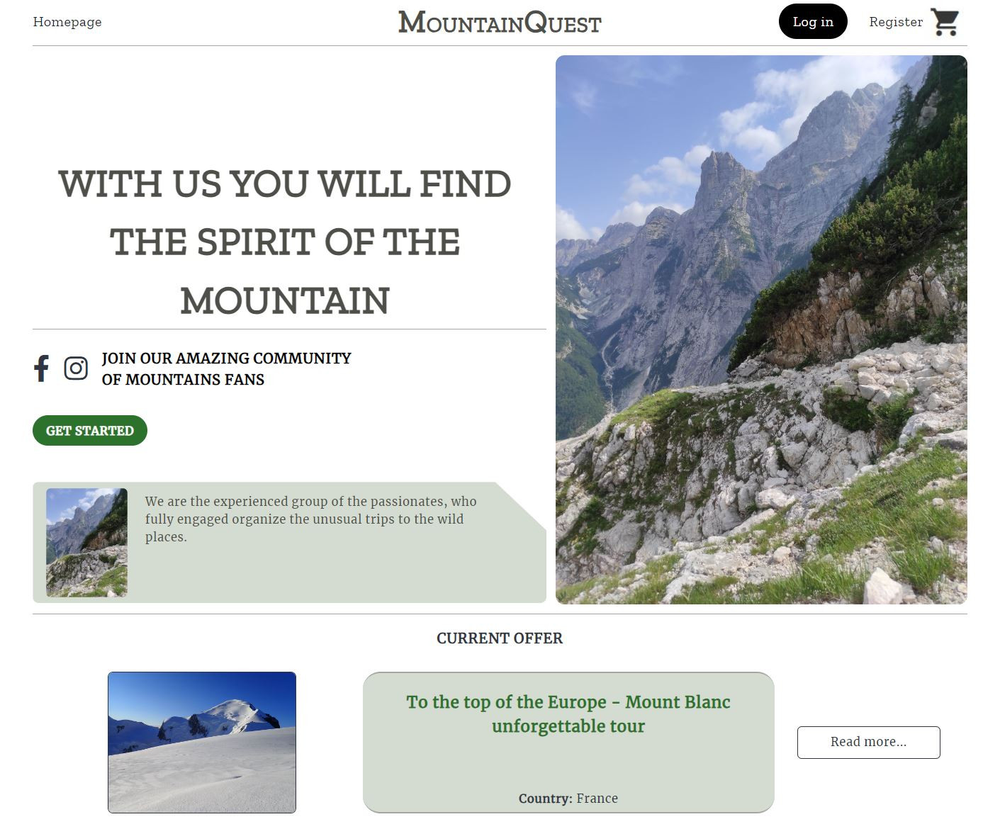
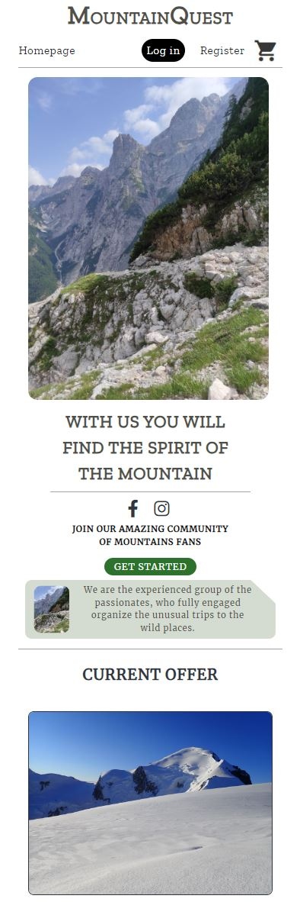
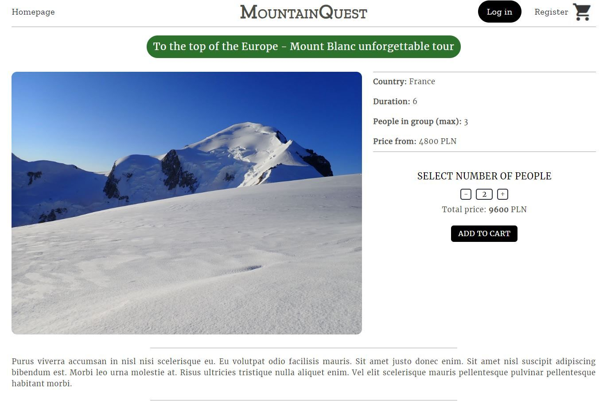
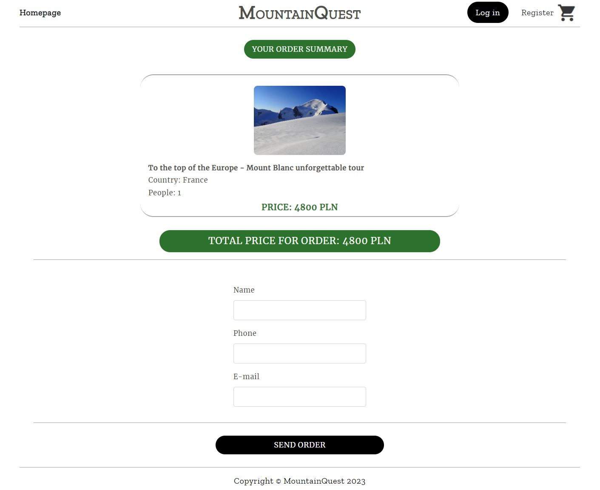
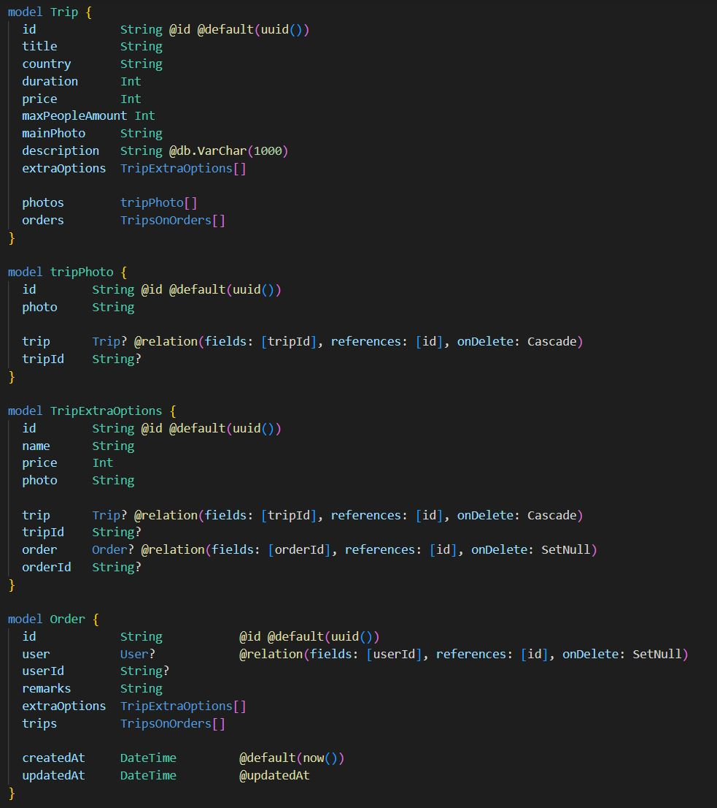
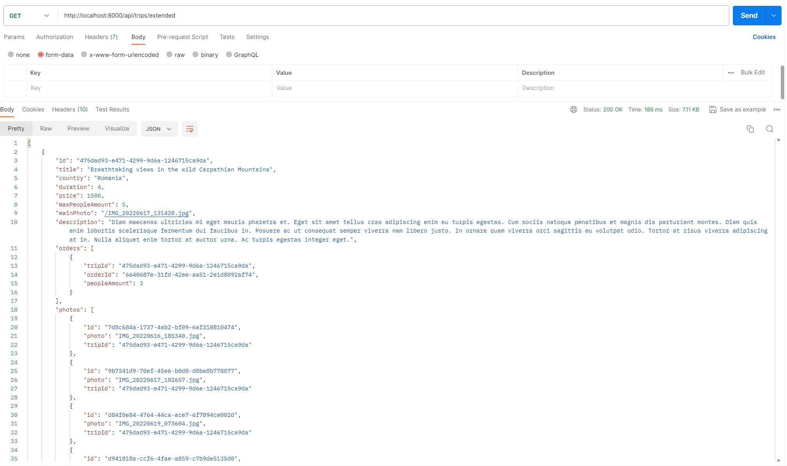

# Travel Agency

The travel agency website presents the current offers and allows the convenient purchase of trips.

## [Demo (click)](https://travel-agency-k39m.onrender.com/)

## Technologies

- HTML
- CSS/SCSS
- RWD
- Node.js
- TypeScript
- MySQL
- Prisma
- React
- Redux

The application was entirely created and developed by the single author, Bartłomiej Pedryc. This is an application covering both backend and frontend, providing a comprehensive user experience. The application operates on a MySQL database on a remote server, and database operations are performed using the Prisma tool in TypeScript.

## Screenshots

## Main page displayed on big screens
  
  
## Main page displayed on small devices
  

## Trip details subpage
  

## Cart content
  

## Order confirmation subpage
  

## Part of schema.prisma file 
  Selected part from the prisma.schema file containing the definitions of data models, as well as relations between tables in the MySQL database.
  

## Postman
  The validity of endpoint functionality for certain methods was verified using, for example, the Postman application.
  

## MySql
  An example of MySQL table used in the application. 
  

